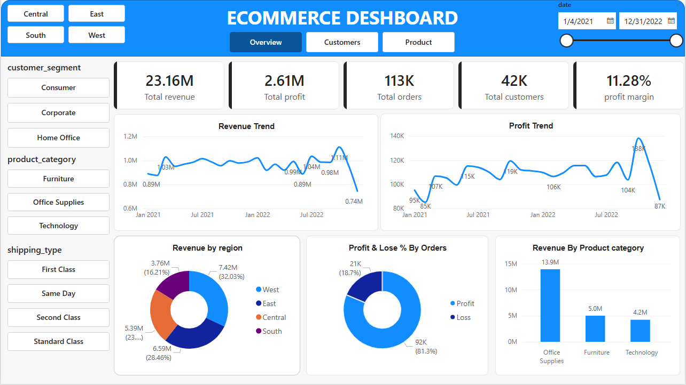

# 📊 E-Commerce Sales Dashboard | Power BI

## 📌 Project Overview

This project presents an interactive **E-Commerce Sales Dashboard** built using **Power BI**. The dashboard provides insights into sales performance, customer behavior, and product performance, enabling stakeholders to monitor KPIs and make informed business decisions.

---

# 🎯 Business Objectives

The dashboard was developed to answer the following business questions:

- How is the business performing overall?
- Which customer segment contributes the most revenue?
- Which product categories generate the highest sales?
- Which products are the top and bottom performers?
- How does sales performance vary across regions?
- What are the purchasing patterns of customers?

---

# 📂 Dataset Information

| Attribute | Details |
|-----------|---------|
| Dataset | E-Commerce Sales Dataset |
| Records | 113,000+ |
| Analysis Period | 4 January 2021 – 31 December 2022 |
| Duration | 727 Days |
| Tool | Microsoft Power BI |
| Languages | DAX, Power Query (M) |

---

# 🛠 Data Preparation

The following preprocessing steps were completed before building the dashboard.

- Imported the dataset into Power BI
- Verified data types
- Removed duplicate records
- Created calculated columns
- Built DAX measures
- Created business KPIs
- Validated data quality

### Data Quality Validation

During data validation, approximately **17.7%** of delivery-related records contained inconsistent delivery dates. To maintain reporting accuracy, delivery analysis was excluded from the final dashboard.

---

# 📊 Dashboard Pages

## Executive Overview

The Executive Overview provides a high-level summary of business performance.

### KPIs

- Total Revenue
- Total Profit
- Total Orders
- Total Customers
- Profit Margin

### Visuals

- Revenue Trend
- Profit Trend
- Revenue by Region
- Revenue by Product Category
- Profit vs Loss Distribution

### Dashboard Preview

---

## Customer Analysis

This page focuses on customer purchasing behavior and customer segmentation.

### KPIs

- Total Revenue
- Total Profit
- Total Orders
- Total Customers
- Average Order Value

### Visuals

- Customer Distribution by Segment
- Revenue by Customer Segment
- Orders by Shipping Type
- Customer Purchases by Product Category
- Orders by Region

### Dashboard Preview

---

## Product Analysis

This page evaluates product sales performance and profitability.

### KPIs

- Total Revenue
- Total Profit
- Total Orders
- Total Customers
- Profit Margin

### Visuals

- Top 5 Products by Revenue
- Bottom 5 Products by Revenue
- Top 5 Products by Profit
- Bottom 5 Products by Profit
- Profit by Product Category

### Dashboard Preview

---

# 📈 Key Performance Indicators

- Total Revenue
- Total Profit
- Total Orders
- Total Customers
- Profit Margin
- Average Order Value (AOV)

---

# 💡 Key Business Insights

- Office Supplies generated the highest revenue among all product categories.
- Consumer customers contributed the highest share of total revenue.
- Standard Class was the most preferred shipping method.
- Revenue varied across customer regions.
- A small number of products contributed a significant share of total revenue.
- Product profitability differed considerably across categories.

---

# 🧮 DAX Measures

The project includes several business measures, including:

- Total Revenue
- Total Profit
- Total Orders
- Total Customers
- Profit Margin
- Average Order Value
- Revenue per Customer

---

# 💻 Skills Demonstrated

- Power BI Dashboard Development
- Data Cleaning
- Power Query
- DAX
- Data Modeling
- KPI Design
- Business Analysis
- Interactive Dashboard Design
- Data Visualization

---

# 🚀 Future Improvements

- Customer Retention Analysis
- Customer Lifetime Value (CLV)
- Delivery Performance Analysis after resolving data quality issues
- Year-over-Year Sales Growth
- Sales Forecasting

---

# 🛠 Tools & Technologies

- Microsoft Power BI
- Power Query (M)
- DAX
- Microsoft Excel

---

# 📬 Contact

**GitHub:** https://github.com/yourusername

**LinkedIn:** https://linkedin.com/in/yourprofile
